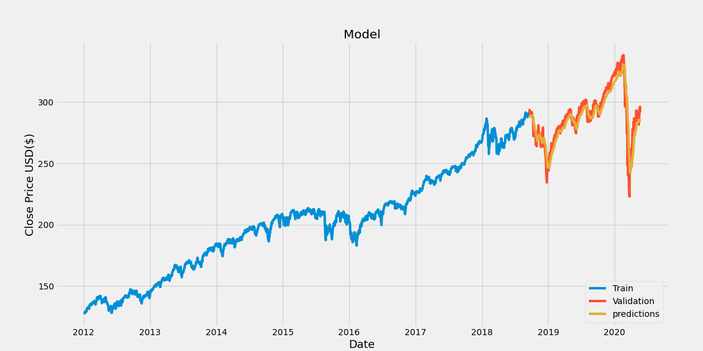

# ml_stock_prediction

This program uses an artificial recurrent neural network called Long Short Term Memory(LSTM) to predict the closing stock price using past 60 day data.

Data Source: Yahoo

Currently getting an error rate of ~2%

