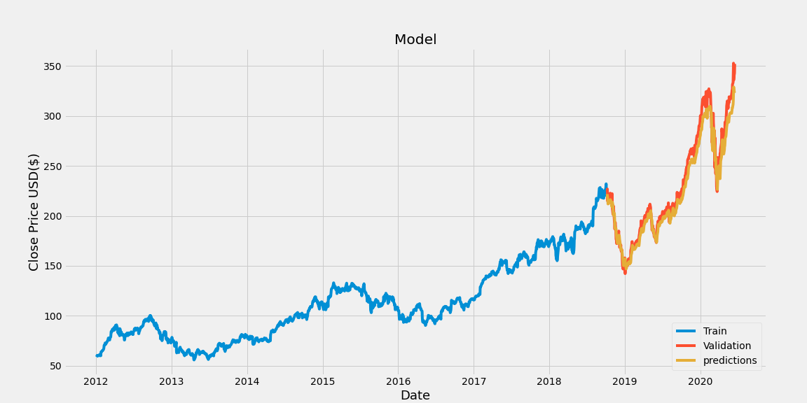

# Stock Prices Prediction using Machine Learning

This program uses an artificial recurrent neural network called Long Short Term Memory(LSTM) to predict the stock price using past 60 day data.

## Data Source: Yahoo Finacne
Used `pandas_datareader` to read data from Yahoo Finance. This is a great alternative to reading data from APIs. Yahoo Finance is one of the many data sources currently being supported for this library.

Used dynamic dates for end date to GET data up until 'today' everytime the program is ran. 

## Technologies used: Python, Machine Learning, Jupyter Notebook

Currently getting an error rate of ~2%

## Steps:

#### df.shape to get the number of rows and columns in the date  

#### Visualize Historical Data  

#### Filter columns, convert the data into numpy array and get # of rows to train the data on  

#### Scale the data  

